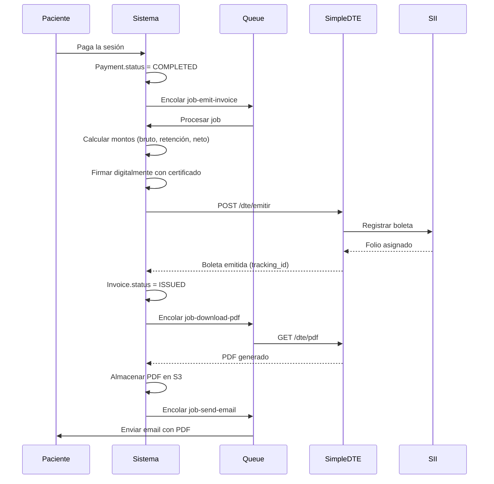

# 💼 Automatización de Boletas de Honorarios (SII) - Arquitectura Técnica

## 📋 Índice
1. [Contexto Legal y Fiscal](#contexto-legal-y-fiscal)
2. [Esquema de Base de Datos](#esquema-de-base-de-datos)
3. [Arquitectura de Integración](#arquitectura-de-integración)
4. [Flujo de Emisión Automática](#flujo-de-emisión-automática)
5. [Endpoints de API](#endpoints-de-api)
6. [Matriz de Validación](#matriz-de-validación)
7. [Seguridad y Certificados](#seguridad-y-certificados)

---

## 1️⃣ Contexto Legal y Fiscal (Chile 2026)

### 1.1 Marco Regulatorio

```
Ley de Renta - Art. 42 Nº 2
- Obligación de emitir boleta electrónica
- Retención de impuesto a la renta: 15.25% (2026)
- Plazo de emisión: Mismo día de prestación del servicio
```

### 1.2 Cálculo de Retenciones

```python
# Ejemplo: Sesión de $50.000
MONTO_BRUTO = 50000
TASA_RETENCION_2026 = 0.1525  # 15.25%

retencion = MONTO_BRUTO * TASA_RETENCION_2026  # $7,625
liquido_profesional = MONTO_BRUTO - retencion   # $42,375

# PsyConnect cobra comisión sobre monto bruto
COMISION_PLATAFORMA = 0.08  # 8%
comision = MONTO_BRUTO * COMISION_PLATAFORMA   # $4,000

# Líquido final para el profesional
liquido_final = liquido_profesional - comision  # $38,375
```

### 1.3 Tipos de Boleta

| Tipo | Código | Descripción | Uso en PsyConnect |
|------|--------|-------------|-------------------|
| BHE | 41 | Boleta de Honorarios Electrónica | ✅ Principal |
| BHLE | 42 | Boleta Honorarios Libre Ejercicio | ❌ No aplica |
| Nota de Crédito | 111 | Anulación/Corrección | ✅ Para cancelaciones |

---

## 2️⃣ Esquema de Base de Datos

### 2.1 Tablas de Boletas

```prisma
// ============================================
// CERTIFICADOS DIGITALES
// ============================================

model ProfessionalCertificate {
  id                  String                    @id @default(cuid())
  professionalId      String                    @unique
  
  // Información del certificado
  certificateType     CertificateType           // "SIMPLE", "ADVANCED"
  issuer              String                    // "E-SIGN", "ACEPTA", etc.
  serialNumber        String
  validFrom           DateTime
  validUntil          DateTime
  
  // Almacenamiento seguro
  // NUNCA almacenar el certificado completo en texto plano
  encryptedKeystore   Bytes                     // .p12 o .pfx encriptado
  keystoreAlias       String?
  
  // Hash de verificación (para validar integridad)
  certificateHash     String                    @unique
  
  // Metadata
  subjectDN           String                    // Distinguished Name
  issuerDN            String
  
  // Control
  isActive            Boolean                   @default(true)
  lastUsedAt          DateTime?
  usageCount          Int                       @default(0)
  
  createdAt           DateTime                  @default(now())
  updatedAt           DateTime                  @updatedAt
  
  // Relaciones
  professional        Professional              @relation(fields: [professionalId], references: [id], onDelete: Cascade)
  invoices            Invoice[]
  
  @@index([professionalId])
  @@index([validUntil])
}

// ============================================
// BOLETAS ELECTRÓNICAS
// ============================================

model Invoice {
  id                  String                    @id @default(cuid())
  
  // Referencias
  appointmentId       String                    @unique
  professionalId      String
  patientId           String
  certificateId       String?
  
  // Identificadores SII
  siiInvoiceNumber    BigInt?                   // Folio asignado por el SII
  siiTrackingId       String?                   @unique // ID de seguimiento
  siiAuthCode         String?                   // Código de autorización
  siiURL              String?                   // URL del PDF en SII
  
  // Tipo de documento
  documentType        InvoiceDocumentType       @default(BHE) // BHE, NOTA_CREDITO
  
  // Montos (en pesos chilenos)
  grossAmount         Int                       // Monto bruto (honorario)
  retentionRate       Float                     @default(0.1525) // 15.25% en 2026
  retentionAmount     Int                       // Monto retenido
  netAmount           Int                       // Líquido para profesional
  
  platformCommission  Int                       // Comisión de PsyConnect
  finalAmount         Int                       // Líquido final al profesional
  
  // Información fiscal
  issueDate           DateTime                  @default(now())
  periodMonth         Int                       // Mes del período tributario (1-12)
  periodYear          Int                       // Año del período
  
  // Descripción del servicio
  serviceDescription  String                    // "Sesión psicológica individual"
  serviceDate         DateTime                  // Fecha de la sesión
  
  // Estado de emisión
  status              InvoiceStatus             @default(PENDING)
  
  // Estados posibles:
  // PENDING: Esperando emisión
  // PROCESSING: En proceso de emisión con SII
  // ISSUED: Emitida exitosamente
  // FAILED: Error en emisión
  // CANCELLED: Anulada (con nota de crédito)
  
  // Datos del receptor (paciente/empresa pagadora)
  receiverRut         String                    // RUT del receptor
  receiverName        String                    // Nombre del receptor
  receiverAddress     String?
  receiverEmail       String?
  
  // Firma digital
  isSigned            Boolean                   @default(false)
  signedAt            DateTime?
  signatureHash       String?                   // Hash de la firma
  
  // Archivo PDF
  pdfUrl              String?                   // URL del PDF generado
  pdfStoragePath      String?                   // Path en S3 o storage
  
  // Tracking de errores
  lastError           String?
  errorCount          Int                       @default(0)
  lastAttemptAt       DateTime?
  
  // Timestamps
  issuedAt            DateTime?                 // Cuando se emitió exitosamente
  createdAt           DateTime                  @default(now())
  updatedAt           DateTime                  @updatedAt
  
  // Relaciones
  appointment         Appointment               @relation(fields: [appointmentId], references: [id])
  professional        Professional              @relation(fields: [professionalId], references: [id])
  patient             User                      @relation("PatientInvoices", fields: [patientId], references: [id])
  certificate         ProfessionalCertificate?  @relation(fields: [certificateId], references: [id])
  creditNote          CreditNote?               @relation("InvoiceCreditNote")
  
  @@index([professionalId])
  @@index([appointmentId])
  @@index([status])
  @@index([issueDate])
  @@index([siiInvoiceNumber])
}

// ============================================
// NOTAS DE CRÉDITO (Anulaciones)
// ============================================

model CreditNote {
  id                  String                    @id @default(cuid())
  
  // Referencia a la boleta original
  originalInvoiceId   String                    @unique
  originalInvoice     Invoice                   @relation("InvoiceCreditNote", fields: [originalInvoiceId], references: [id])
  
  // Identificadores SII
  siiCreditNoteNumber BigInt?
  siiTrackingId       String?                   @unique
  siiAuthCode         String?
  
  // Motivo de anulación
  reason              CreditNoteReason
  reasonText          String?
  
  // Montos (deben coincidir con la boleta original)
  grossAmount         Int
  retentionAmount     Int
  netAmount           Int
  
  // Estado
  status              InvoiceStatus             @default(PENDING)
  
  // Firma
  isSigned            Boolean                   @default(false)
  signedAt            DateTime?
  
  // PDF
  pdfUrl              String?
  
  // Timestamps
  issueDate           DateTime                  @default(now())
  issuedAt            DateTime?
  createdAt           DateTime                  @default(now())
  updatedAt           DateTime                  @updatedAt
  
  @@index([originalInvoiceId])
  @@index([status])
}

// ============================================
// LOG DE INTEGRACIONES CON SII
// ============================================

model SIIIntegrationLog {
  id                  String                    @id @default(cuid())
  
  // Referencia
  invoiceId           String?
  professionalId      String
  
  // Acción realizada
  action              SIIAction                 // EMIT, CANCEL, QUERY, DOWNLOAD
  endpoint            String                    // URL del servicio llamado
  
  // Request
  requestPayload      String                    // JSON del request
  requestHeaders      String?
  
  // Response
  responseStatus      Int?                      // HTTP status
  responseBody        String?                   // Respuesta del SII
  responseTime        Int?                      // Tiempo de respuesta (ms)
  
  // Resultado
  isSuccess           Boolean
  errorCode           String?
  errorMessage        String?
  
  // Metadata
  ipAddress           String?
  userAgent           String?
  
  createdAt           DateTime                  @default(now())
  
  @@index([professionalId])
  @@index([invoiceId])
  @@index([action])
  @@index([createdAt])
}

// ============================================
// CONFIGURACIÓN FISCAL DEL PROFESIONAL
// ============================================

model ProfessionalTaxSettings {
  id                  String                    @id @default(cuid())
  professionalId      String                    @unique
  
  // Datos fiscales
  rut                 String                    @unique
  businessName        String                    // Razón social o nombre
  businessActivity    String?                   // Giro o actividad
  
  // Dirección fiscal
  address             String
  comuna              String
  region              String
  postalCode          String?
  
  // Configuración de emisión
  autoIssueEnabled    Boolean                   @default(false) // Auto-emisión activada
  issueDelay          Int                       @default(0)     // Delay en minutos
  
  // Preferencias
  includePatientEmail Boolean                   @default(true)  // Enviar copia al paciente
  defaultDescription  String?                   // Descripción por defecto
  
  // Última boleta emitida
  lastInvoiceNumber   BigInt?
  lastInvoiceDate     DateTime?
  
  createdAt           DateTime                  @default(now())
  updatedAt           DateTime                  @updatedAt
  
  professional        Professional              @relation(fields: [professionalId], references: [id], onDelete: Cascade)
  
  @@index([rut])
}
```

### 2.2 Enums

```prisma
enum CertificateType {
  SIMPLE          // Firma electrónica simple
  ADVANCED        // Firma electrónica avanzada (requerida SII)
}

enum InvoiceDocumentType {
  BHE             // Boleta Honorarios Electrónica (41)
  NOTA_CREDITO    // Nota de Crédito (111)
}

enum InvoiceStatus {
  PENDING         // Esperando emisión
  PROCESSING      // En proceso con SII
  ISSUED          // Emitida exitosamente
  FAILED          // Error en emisión
  CANCELLED       // Anulada (con nota de crédito)
}

enum CreditNoteReason {
  APPOINTMENT_CANCELLED    // Cita cancelada
  DUPLICATE               // Boleta duplicada
  ERROR_AMOUNT            // Error en monto
  SERVICE_NOT_PROVIDED    // Servicio no prestado
  OTHER                   // Otro motivo
}

enum SIIAction {
  EMIT            // Emisión de boleta
  CANCEL          // Anulación
  QUERY           // Consulta de estado
  DOWNLOAD        // Descarga de PDF
  VALIDATE        // Validación de certificado
}
```

---

## 3️⃣ Arquitectura de Integración

### 3.1 Opciones de Servicios (Chile)

| Servicio | Ventajas | Desventajas | Costo | Recomendación |
|----------|----------|-------------|-------|---------------|
| **SimpleBoleta** | API REST simple, buenos docs | Solo boletas, sin DTE | $9.990/mes | ⭐⭐⭐ Recomendado MVP |
| **SimpleDTE** | Completo, incluye facturas | Más complejo | $19.990/mes | ⭐⭐⭐⭐ Escalable |
| **Facturante** | Económico | Menos features | $7.990/mes | ⭐⭐ Alternativa |
| **API SII Directa** | Sin intermediarios, gratis | Muy compleja, requiere certificación | Gratis | ⭐ Solo para expertos |

**Decisión**: Usar **SimpleDTE** para producción (escalabilidad futura).

### 3.2 Arquitectura de Alto Nivel

```
┌─────────────────────────────────────────────────────────────┐
│                    FRONTEND (Next.js)                        │
│  - Dashboard Profesional                                     │
│  - Vista de boletas emitidas                                 │
│  - Configuración fiscal                                      │
└────────────────────┬────────────────────────────────────────┘
                     │
                     │ HTTPS
                     │
┌────────────────────▼────────────────────────────────────────┐
│                 BACKEND (Next.js API Routes)                 │
│                                                               │
│  ┌─────────────────────────────────────────────────────┐    │
│  │  Invoice Service                                     │    │
│  │  - Crear boleta                                      │    │
│  │  - Firmar digitalmente                               │    │
│  │  - Enviar a SimpleDTE                                │    │
│  └─────────────────┬────────────────────────────────────┘   │
│                    │                                          │
│  ┌────────────────▼────────────────────────────────────┐    │
│  │  Queue Service (Bull/BullMQ)                        │    │
│  │  - job-emit-invoice                                  │    │
│  │  - job-download-pdf                                  │    │
│  │  - job-send-email                                    │    │
│  └─────────────────┬────────────────────────────────────┘   │
│                    │                                          │
└────────────────────┼──────────────────────────────────────────┘
                     │
         ┌───────────┴──────────┐
         │                       │
         │                       │
┌────────▼──────────┐   ┌───────▼────────────┐
│   SimpleDTE API    │   │    SII (Indirecto) │
│  - POST /dte/emitir│   │   - Validación      │
│  - GET /dte/pdf    │   │   - Registro        │
│  - POST /dte/anular│   │   - Folio           │
└────────────────────┘   └────────────────────┘
         │
         │ Webhook
         │
┌────────▼──────────┐
│  Webhook Handler  │
│  - Estado: Emitido│
│  - PDF disponible │
│  - Folio asignado │
└───────────────────┘
```

### 3.3 Flujo de Datos



---

## 4️⃣ Flujo de Emisión Automática

### 4.1 Trigger: Pago Confirmado

```typescript
// src/services/invoice/invoice-automation.service.ts

import { PrismaClient } from '@prisma/client'
import { Queue } from 'bullmq'

const prisma = new PrismaClient()
const invoiceQueue = new Queue('invoice-processing')

/**
 * Servicio que se ejecuta cuando un pago es confirmado
 * Integrado en el webhook de Flow o al confirmar pago manual
 */
export async function onPaymentConfirmed(appointmentId: string) {
    // 1. Obtener datos de la cita
    const appointment = await prisma.appointment.findUnique({
        where: { id: appointmentId },
        include: {
            professional: {
                include: {
                    user: true,
                    taxSettings: true,
                    certificate: {
                        where: { isActive: true }
                    }
                }
            },
            patient: true,
            payment: true
        }
    })
    
    if (!appointment) {
        throw new Error('Appointment not found')
    }
    
    // 2. Validar que el profesional tiene auto-emisión activada
    const taxSettings = appointment.professional.taxSettings
    
    if (!taxSettings?.autoIssueEnabled) {
        console.log('Auto-issue disabled for professional:', appointment.professionalId)
        return { autoIssue: false }
    }
    
    // 3. Validar certificado digital activo
    const certificate = appointment.professional.certificate?.[0]
    
    if (!certificate || new Date(certificate.validUntil) < new Date()) {
        throw new Error('CERT_ERROR: No valid certificate found')
    }
    
    // 4. Calcular montos
    const amounts = calculateInvoiceAmounts(
        appointment.payment.amount,
        0.1525,  // Retención 2026
        0.08     // Comisión plataforma
    )
    
    // 5. Crear registro de boleta (estado PENDING)
    const invoice = await prisma.invoice.create({
        data: {
            appointmentId: appointment.id,
            professionalId: appointment.professionalId,
            patientId: appointment.patientId,
            certificateId: certificate.id,
            
            documentType: 'BHE',
            status: 'PENDING',
            
            grossAmount: amounts.gross,
            retentionRate: amounts.retentionRate,
            retentionAmount: amounts.retention,
            netAmount: amounts.net,
            platformCommission: amounts.commission,
            finalAmount: amounts.final,
            
            periodMonth: new Date(appointment.scheduledAt).getMonth() + 1,
            periodYear: new Date(appointment.scheduledAt).getFullYear(),
            
            serviceDescription: `Sesión psicológica individual - ${appointment.professional.user.name}`,
            serviceDate: appointment.scheduledAt,
            
            receiverRut: appointment.patient.rut || '66666666-6', // RUT genérico si no tiene
            receiverName: appointment.patient.name,
            receiverEmail: appointment.patient.email,
        }
    })
    
    // 6. Encolar job de emisión
    await invoiceQueue.add('emit-invoice', {
        invoiceId: invoice.id,
        delay: taxSettings.issueDelay * 60 * 1000  // Convertir minutos a ms
    }, {
        attempts: 3,
        backoff: {
            type: 'exponential',
            delay: 5000
        }
    })
    
    return {
        autoIssue: true,
        invoiceId: invoice.id,
        status: 'QUEUED'
    }
}

/**
 * Cálculo de montos de la boleta
 */
function calculateInvoiceAmounts(
    grossAmount: number,
    retentionRate: number,
    commissionRate: number
) {
    const retention = Math.round(grossAmount * retentionRate)
    const netAmount = grossAmount - retention
    const commission = Math.round(grossAmount * commissionRate)
    const finalAmount = netAmount - commission
    
    return {
        gross: grossAmount,
        retentionRate,
        retention,
        net: netAmount,
        commission,
        final: finalAmount
    }
}
```

### 4.2 Worker: Emisión en Background

```typescript
// src/workers/invoice.worker.ts

import { Worker, Job } from 'bullmq'
import { PrismaClient } from '@prisma/client'
import { SimpleDTEService } from '../services/invoice/simple-dte.service'
import { CertificateService } from '../services/invoice/certificate.service'
import { StorageService } from '../services/storage.service'

const prisma = new PrismaClient()
const simpleDTE = new SimpleDTEService(process.env.SIMPLE_DTE_API_KEY!)
const certificateService = new CertificateService()
const storage = new StorageService()

const invoiceWorker = new Worker('invoice-processing', async (job: Job) => {
    const { invoiceId } = job.data
    
    try {
        // 1. Obtener boleta
        const invoice = await prisma.invoice.findUnique({
            where: { id: invoiceId },
            include: {
                professional: {
                    include: {
                        user: true,
                        taxSettings: true
                    }
                },
                patient: true,
                certificate: true
            }
        })
        
        if (!invoice) {
            throw new Error('Invoice not found')
        }
        
        // 2. Actualizar estado a PROCESSING
        await prisma.invoice.update({
            where: { id: invoiceId },
            data: {
                status: 'PROCESSING',
                lastAttemptAt: new Date()
            }
        })
        
        // 3. Preparar datos para SimpleDTE
        const dteData = {
            // Datos del emisor (profesional)
            emisor: {
                rut: invoice.professional.taxSettings.r,
                razon_social: invoice.professional.taxSettings.businessName,
                giro: invoice.professional.taxSettings.businessActivity,
                direccion: invoice.professional.taxSettings.address,
                comuna: invoice.professional.taxSettings.comuna
            },
            
            // Datos del receptor (paciente)
            receptor: {
                rut: invoice.receiverRut,
                razon_social: invoice.receiverName,
                direccion: invoice.receiverAddress || 'No especificada',
                comuna: 'Santiago',  // Por defecto
                email: invoice.receiverEmail
            },
            
            // Documento
            documento: {
                tipo: 41,  // Boleta de Honorarios
                fecha: invoice.issueDate.toISOString().split('T')[0],
                
                // Detalle del servicio
                items: [{
                    nombre: invoice.serviceDescription,
                    cantidad: 1,
                    precio: invoice.grossAmount,
                    monto: invoice.grossAmount
                }],
                
                // Totales
                monto_total: invoice.grossAmount,
                monto_neto: invoice.netAmount,
                monto_retencion: invoice.retentionAmount,
                tasa_retencion: invoice.retentionRate * 100  // En porcentaje
            }
        }
        
        // 4. Firmar digitalmente (si se requiere firma local)
        const signedData = await certificateService.signDocument(
            dteData,
            invoice.certificate
        )
        
        // 5. Emitir en SimpleDTE
        const siiResponse = await simpleDTE.emitInvoice({
            ...dteData,
            firma: signedData
        })
        
        // 6. Guardar respuesta del SII
        await prisma.invoice.update({
            where: { id: invoiceId },
            data: {
                status: 'ISSUED',
                siiInvoiceNumber: siiResponse.folio,
                siiTrackingId: siiResponse.tracking_id,
                siiAuthCode: siiResponse.codigo_autorizacion,
                siiURL: siiResponse.pdf_url,
                isSigned: true,
                signedAt: new Date(),
                issuedAt: new Date()
            }
        })
        
        // 7. Descargar y almacenar PDF
        const pdfBuffer = await simpleDTE.downloadPDF(siiResponse.tracking_id)
        const pdfPath = `invoices/${invoice.professionalId}/${invoiceId}.pdf`
        const pdfUrl = await storage.uploadFile(pdfPath, pdfBuffer, 'application/pdf')
        
        await prisma.invoice.update({
            where: { id: invoiceId },
            data: {
                pdfUrl,
                pdfStoragePath: pdfPath
            }
        })
        
        // 8. Enviar email al paciente y profesional
        await sendInvoiceEmails(invoice, pdfUrl)
        
        // 9. Log exitoso
        await prisma.sIIIntegrationLog.create({
            data: {
                invoiceId,
                professionalId: invoice.professionalId,
                action: 'EMIT',
                endpoint: '/dte/emitir',
                requestPayload: JSON.stringify(dteData),
                responseStatus: 200,
                responseBody: JSON.stringify(siiResponse),
                isSuccess: true
            }
        })
        
        return { success: true, folio: siiResponse.folio }
        
    } catch (error) {
        console.error('Error emitting invoice:', error)
        
        // Incrementar contador de errores
        await prisma.invoice.update({
            where: { id: invoiceId },
            data: {
                status: 'FAILED',
                lastError: error.message,
                errorCount: { increment: 1 },
                lastAttemptAt: new Date()
            }
        })
        
        // Log de error
        await prisma.sIIIntegrationLog.create({
            data: {
                invoiceId,
                professionalId: invoice.professionalId,
                action: 'EMIT',
                endpoint: '/dte/emitir',
                isSuccess: false,
                errorCode: error.code || 'UNKNOWN',
                errorMessage: error.message
            }
        })
        
        throw error
    }
}, {
    connection: {
        host: process.env.REDIS_HOST || 'localhost',
        port: parseInt(process.env.REDIS_PORT || '6379')
    }
})

invoiceWorker.on('completed', (job) => {
    console.log(`✅ Invoice ${job.data.invoiceId} emitted successfully`)
})

invoiceWorker.on('failed', (job, err) => {
    console.error(`❌ Invoice ${job?.data.invoiceId} failed:`, err)
})
```

---

## 5️⃣ Endpoints de API

### 5.1 Configuración de Certificado

```typescript
// POST /api/professional/certificate/upload
interface UploadCertificateRequest {
  certificateFile: File  // .p12 o .pfx
  password: string       // Password del certificado
  alias?: string         // Alias (opcional)
}

interface UploadCertificateResponse {
  success: boolean
  certificateId: string
  validFrom: string
  validUntil: string
  issuer: string
  subjectDN: string
}

// GET /api/professional/certificate
interface GetCertificateResponse {
  hasActiveCertificate: boolean
  certificate?: {
    id: string
    issuer: string
    validFrom: string
    validUntil: string
    daysUntilExpiry: number
    usageCount: number
    lastUsedAt?: string
  }
}

// DELETE /api/professional/certificate/{id}
```

### 5.2 Configuración Fiscal

```typescript
// POST /api/professional/tax-settings
interface UpdateTaxSettingsRequest {
  rut: string
  businessName: string
  businessActivity?: string
  address: string
  comuna: string
  region: string
  postalCode?: string
  autoIssueEnabled: boolean
  issueDelay?: number  // Minutos
  includePatientEmail?: boolean
  defaultDescription?: string
}

// GET /api/professional/tax-settings
```

### 5.3 Gestión de Boletas

```typescript
// GET /api/professional/invoices
interface GetInvoicesRequest {
  page?: number
  limit?: number
  status?: 'PENDING' | 'PROCESSING' | 'ISSUED' | 'FAILED' | 'CANCELLED'
  fromDate?: string
  toDate?: string
}

interface GetInvoicesResponse {
  invoices: Array<{
    id: string
    siiInvoiceNumber?: number
    appointmentId: string
    patientName: string
    grossAmount: number
    netAmount: number
    retentionAmount: number
    finalAmount: number
    status: string
    issueDate: string
    issuedAt?: string
    pdfUrl?: string
    lastError?: string
  }>
  meta: {
    total: number
    page: number
    limit: number
  }
}

// POST /api/professional/invoices/{id}/retry
// Reintentar emisión de una boleta fallida

// POST /api/professional/invoices/{id}/cancel
interface CancelInvoiceRequest {
  reason: 'APPOINTMENT_CANCELLED' | 'DUPLICATE' | 'ERROR_AMOUNT' | 'SERVICE_NOT_PROVIDED' | 'OTHER'
  reasonText?: string
}

// GET /api/professional/invoices/{id}/pdf
// Descargar PDF de la boleta
```

---

## 6️⃣ Matriz de Validación de Errores

| Código | Tipo | Descripción | Acción del Sistema | Reintento | Mensaje al Usuario |
|--------|------|-------------|--------------------|-----------|--------------------|
| `INV001` | Validación | RUT inválido | Return 400 | No | "El RUT ingresado no es válido" |
| `INV002` | Validación | Monto negativo o cero | Return 400 | No | "El monto debe ser mayor a cero" |
| `INV003` | Negocio | Certificado expirado | Return 403 | No | "Tu certificado digital ha expirado. Actualízalo" |
| `INV004` | Negocio | Certificado no encontrado | Return 404 | No | "Debes subir un certificado digital primero" |
| `INV005` | Negocio | Boleta ya emitida | Return 409 | No | "Esta cita ya tiene una boleta emitida" |
| `INV006` | Integración | Error conexión SII/SimpleDTE | Queue retry | Sí (3x) | "Error temporal al emitir. Reintentando..." |
| `INV007` | Integración | Timeout de SimpleDTE | Queue retry | Sí (3x) | "Servicio SII lento. Reintentando..." |
| `INV008` | SII | Folio agotado | Alert + Manual | No | "Contactar a SimpleDTE - Folios agotados" |
| `INV009` | SII | RUT emisor no autorizado | Return 403 | No | "Tu RUT no está autorizado en el SII" |
| `INV010` | Firma | Error al firmar documento | Return 500 | Sí (1x) | "Error en firma digital. Verifica tu certificado" |
| `INV011` | Storage | Error al subir PDF | Log warning | Sí (2x) | "PDF no disponible temporalmente" |
| `INV012` | Email | Error envío email | Log warning | Sí (2x) | (Silencioso - PDF disponible en dashboard) |
| `INV013` | Negocio | Pago no confirmado | Return 400 | No | "La boleta se emite solo con pago confirmado" |
| `INV014` | Validación | Fecha de servicio futura | Return 400 | No | "No se puede emitir boleta de fecha futura" |
| `INV015` | Sistema | Queue no disponible | Return 503 | Sí (manual) | "Sistema de emisión no disponible" |

---

## 7️⃣ Seguridad y Certificados Digitales

### 7.1 Manejo Seguro del Certificado

```typescript
// src/services/invoice/certificate.service.ts

import crypto from 'crypto'
import forge from 'node-forge'
import { PrismaClient } from '@prisma/client'

const prisma = new PrismaClient()

// Clave maestra de encriptación (debe estar en variables de entorno)
const ENCRYPTION_KEY = process.env.CERTIFICATE_ENCRYPTION_KEY! // 32 bytes
const ENCRYPTION_ALGORITHM = 'aes-256-gcm'

export class CertificateService {
    
    /**
     * Almacenar certificado de forma segura
     */
    async storeCertificate(
        professionalId: string,
        certificateBuffer: Buffer,
        password: string,
        alias?: string
    ) {
        // 1. Validar el certificado antes de almacenar
        const certInfo = await this.validateCertificate(certificateBuffer, password)
        
        // 2. Encriptar el archivo .p12
        const encrypted = this.encryptCertificate(certificateBuffer)
        
        // 3. Calcular hash para verificación de integridad
        const hash = crypto
            .createHash('sha256')
            .update(certificateBuffer)
            .digest('hex')
        
        // 4. Guardar en base de datos
        const certificate = await prisma.professionalCertificate.create({
            data: {
                professionalId,
                certificateType: 'ADVANCED',
                issuer: certInfo.issuer,
                serialNumber: certInfo.serialNumber,
                validFrom: certInfo.validFrom,
                validUntil: certInfo.validUntil,
                encryptedKeystore: encrypted.data,
                keystoreAlias: alias,
                certificateHash: hash,
                subjectDN: certInfo.subjectDN,
                issuerDN: certInfo.issuerDN,
                isActive: true
            }
        })
        
        // NUNCA retornar el certificado encriptado al cliente
        return {
            id: certificate.id,
            validFrom: certificate.validFrom,
            validUntil: certificate.validUntil,
            issuer: certificate.issuer
        }
    }
    
    /**
     * Encriptar certificado con AES-256-GCM
     */
    private encryptCertificate(data: Buffer): { data: Buffer, iv: Buffer, authTag: Buffer } {
        const iv = crypto.randomBytes(16) // Vector de inicialización
        const cipher = crypto.createCipheriv(ENCRYPTION_ALGORITHM, Buffer.from(ENCRYPTION_KEY, 'hex'), iv)
        
        const encrypted = Buffer.concat([
            cipher.update(data),
            cipher.final()
        ])
        
        const authTag = cipher.getAuthTag()
        
        // Combinar IV + AuthTag + Data encriptada
        return {
            data: Buffer.concat([iv, authTag, encrypted]),
            iv,
            authTag
        }
    }
    
    /**
     * Desencriptar certificado
     */
    private decryptCertificate(encryptedBuffer: Buffer): Buffer {
        // Extraer componentes
        const iv = encryptedBuffer.subarray(0, 16)
        const authTag = encryptedBuffer.subarray(16, 32)
        const data = encryptedBuffer.subarray(32)
        
        const decipher = crypto.createDecipheriv(
            ENCRYPTION_ALGORITHM,
            Buffer.from(ENCRYPTION_KEY, 'hex'),
            iv
        )
        
        decipher.setAuthTag(authTag)
        
        return Buffer.concat([
            decipher.update(data),
            decipher.final()
        ])
    }
    
    /**
     * Validar certificado .p12
     */
    private async validateCertificate(
        certificateBuffer: Buffer,
        password: string
    ): Promise<{
        issuer: string
        serialNumber: string
        validFrom: Date
        validUntil: Date
        subjectDN: string
        issuerDN: string
    }> {
        try {
            const p12Der = certificateBuffer.toString('binary')
            const p12Asn1 = forge.asn1.fromDer(p12Der)
            const p12 = forge.pkcs12.pkcs12FromAsn1(p12Asn1, password)
            
            // Obtener certificado
            const certBags = p12.getBags({ bagType: forge.pki.oids.certBag })
            const certBag = certBags[forge.pki.oids.certBag]?.[0]
            
            if (!certBag) {
                throw new Error('No certificate found in .p12 file')
            }
            
            const cert = certBag.cert
            
            // Validar fechas
            const now = new Date()
            if (now < cert.validity.notBefore || now > cert.validity.notAfter) {
                throw new Error('Certificate expired or not yet valid')
            }
            
            return {
                issuer: cert.issuer.getField('CN')?.value || 'Unknown',
                serialNumber: cert.serialNumber,
                validFrom: cert.validity.notBefore,
                validUntil: cert.validity.notAfter,
                subjectDN: cert.subject.attributes.map(attr =>
                    `${attr.shortName}=${attr.value}`
                ).join(', '),
                issuerDN: cert.issuer.attributes.map(attr =>
                    `${attr.shortName}=${attr.value}`
                ).join(', ')
            }
        } catch (error) {
            throw new Error(`Invalid certificate: ${error.message}`)
        }
    }
    
    /**
     * Firmar documento (usado para boletas)
     */
    async signDocument(
        data: any,
        certificate: any
    ): Promise<string> {
        // 1. Desencriptar certificado
        const decrypted = this.decryptCertificate(certificate.encryptedKeystore)
        
        // 2. Convertir a string para firmar
        const dataString = JSON.stringify(data)
        
        // 3. Firmar con RSA-SHA256
        const sign = crypto.createSign('RSA-SHA256')
        sign.update(dataString)
        sign.end()
        
        // Cargar llave privada del certificado
        // (Este código es simplificado, en producción usar forge o similar)
        const signature = sign.sign(decrypted, 'base64')
        
        // 4. Actualizar estadísticas
        await prisma.professionalCertificate.update({
            where: { id: certificate.id },
            data: {
                lastUsedAt: new Date(),
                usageCount: { increment: 1 }
            }
        })
        
        return signature
    }
}
```

### 7.2 Mejores Prácticas de Seguridad

```typescript
// .env.example
# Certificados
CERTIFICATE_ENCRYPTION_KEY=<32-bytes-hex-key>  # Generar con: openssl rand -hex 32

# SimpleDTE
SIMPLE_DTE_API_KEY=<api-key>
SIMPLE_DTE_ENVIRONMENT=production  # o 'sandbox'

# Storage (AWS S3)
AWS_ACCESS_KEY_ID=<key>
AWS_SECRET_ACCESS_KEY=<secret>
AWS_REGION=us-east-1
AWS_S3_BUCKET=psyconnect-invoices

# Redis (para queue)
REDIS_HOST=localhost
REDIS_PORT=6379
REDIS_PASSWORD=<password>
```

**Checklist de Seguridad:**

- ✅ Certificados encriptados con AES-256-GCM
- ✅ Clave de encriptación en variable de entorno (nunca en código)
- ✅ HTTPS obligatorio en producción
- ✅ Auditoría de todos los accesos (SIIIntegrationLog)
- ✅ Rate limiting en endpoints de emisión
- ✅ Validación de permisos (solo el profesional dueño puede emitir)
- ✅ PDFs almacenados en storage seguro (S3 con pre-signed URLs)
- ✅ Rotación de claves de API cada 90 días

---

## 📈 Métricas y Monitoreo

### KPIs de Rendimiento

```typescript
interface InvoiceMetrics {
  // Emisión
  totalIssued: number
  issueSuccessRate: number  // %
  averageIssueTime: number  // segundos
  failureRate: number       // %
  
  // Errores
  mostCommonErrors: Array<{ code: string, count: number }>
  
  // Financiero
  totalGrossAmount: number
  totalRetentions: number
  totalCommissions: number
  totalNetToProfessionals: number
}
```

### Alertas Críticas

| Métrica | Umbral | Acción |
|---------|--------|--------|
| Failure Rate | > 5% | Slack alert + Email a CTO |
| Avg Issue Time | > 30s | Revisar performance SimpleDTE |
| Certificate Expiring | < 30 días | Email al profesional |
| Queue Backlog | > 100 jobs | Escalar workers |

---

## 🚀 Roadmap de Implementación

### Sprint 1: Fundamentos (2 semanas)
- ✅ Modelos de BD
- ✅ Upload de certificados
- ✅ Cálculo de montos
- ✅ Configuración fiscal

### Sprint 2: Integración SimpleDTE (2 semanas)
- 🔄 Servicio de integración
- 🔄 Worker de emisión
- 🔄 Manejo de errores
- 🔄 Testing en sandbox

### Sprint 3: Automatización (1 semana)
- 🔮 Trigger automático post-pago
- 🔮 Emails de confirmación
- 🔮 Dashboard de boletas

### Sprint 4: Producción (1 semana)
- 🔮 Certificación con SimpleDTE
- 🔮 Migración a producción
- 🔮 Monitoreo y alertas

---

**Autor**: CTO PsyConnect  
**Fecha**: Enero 2026  
**Versión**: 1.0
